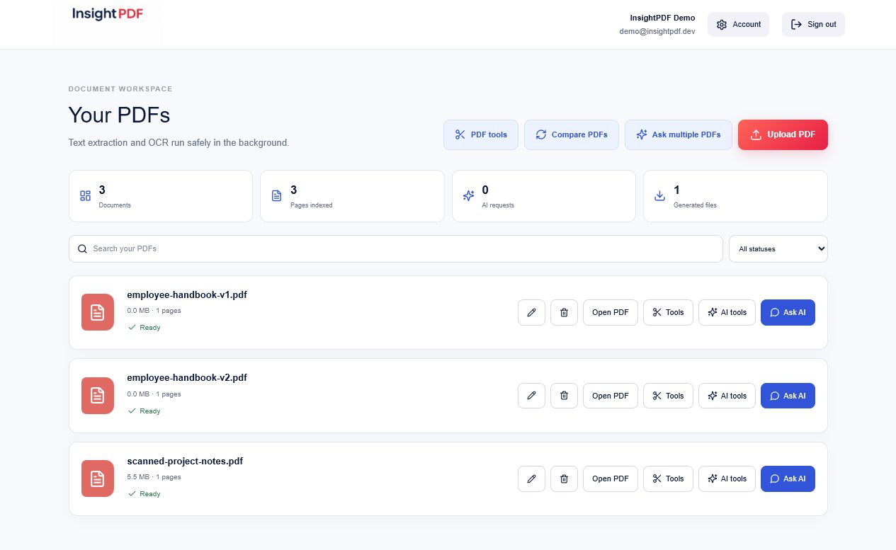

# InsightPDF 2

InsightPDF 2 is an AI document copilot and PDF workspace for uploading, understanding,
comparing, organizing, and transforming PDF documents. It combines asynchronous
document processing, retrieval-augmented generation, OCR, private object storage,
structured AI outputs, and practical PDF tools in one Docker Compose application.



## Features

- Versioned document-tool registry and natural-language, review-before-run workflow plans
- PDF compression presets and configurable page numbering with deterministic output verification
- Registration, login, rotating hashed refresh tokens, logout, profile and password management
- Owner-isolated PDF upload, rename, search, filtering, deletion and authenticated downloads
- Asynchronous PyMuPDF extraction, Tesseract OCR fallback, chunking and local embeddings
- PostgreSQL/pgvector retrieval across one or more selected documents
- Conversational RAG with stored conversations, follow-ups, snippets and clickable page citations
- Cached short/detailed summaries, key points, action items, quizzes and translations
- Schema-validated information extraction and deterministic-plus-semantic document comparison
- Merge, split, rotate, delete/extract pages, PDF-to-images and images-to-PDF
- Background DOCX-to-PDF, PDF-to-DOCX, and DOCX-to-Markdown conversion
- Text/image watermarks with page, position, opacity and rotation controls
- Durable owner-scoped Celery jobs for AI and PDF operations, progress, errors and retry metadata
- PDF.js viewer with thumbnails, navigation, zoom, search and citation jumps
- Dashboard metrics, processing indicators, generated-file history and admin controls
- Seeded text, scanned and version-comparison PDFs for the public demo

## Architecture

```text
Browser
  |
  v
Nginx :8080
  |-- /             -> React/Vite client
  `-- /api/v1       -> FastAPI
                        |-- PostgreSQL + pgvector
                        |-- MinIO through a replaceable storage interface
                        |-- Redis rate limits and Celery broker/backend
                        |-- Celery ingestion and operation workers
                        `-- OpenAI-compatible LLM API
```

The application is a modular monolith: HTTP routes, schemas, persistence,
security, retrieval, AI services, PDF operations, storage, and tasks have
separate modules while sharing one deployment boundary. See
[ARCHITECTURE.md](ARCHITECTURE.md).

## Why these technologies

- **FastAPI** provides typed asynchronous APIs, dependency injection and OpenAPI documentation.
- **Celery and Redis** keep OCR, indexing, AI generation and transformations outside request workers.
- **PostgreSQL and pgvector** keep relational ownership data and vector retrieval in one transactional store.
- **MinIO** gives the local and portfolio deployments private S3-compatible object storage.
- **Sentence Transformers** generates embeddings locally without a paid embedding API.
- **Tesseract** handles scanned pages only when native text is below the configured threshold.
- **RAG** grounds model responses in owner-authorized document chunks and preserves page citations.
- **PDF.js** renders private authenticated PDFs without exposing object-storage URLs.

## Stack

React 19, TypeScript, Vite, Tailwind CSS, PDF.js, Vitest, Playwright,
FastAPI, Pydantic, SQLAlchemy 2, Alembic, PostgreSQL 16, pgvector, Celery,
Redis, MinIO, Sentence Transformers, PyMuPDF, pypdf, Pillow, Tesseract and Nginx.

## Quick start

Requirements: Docker Desktop with Docker Compose.

```bash
cp .env.example .env
# Replace JWT_SECRET and storage/database credentials.
# Set LLM_API_KEY, LLM_BASE_URL and LLM_MODEL.
docker compose up --build -d
docker compose ps
```

Open:

- Application: `http://localhost:8080`
- API documentation: `http://localhost:8000/docs`
- MinIO console: `http://localhost:9001`

Demo credentials:

```text
Email: demo@insightpdf.dev
Password: DemoPassword123!
```

The startup seed is idempotent and creates a native-text PDF, a scanned PDF,
and two handbook versions. Replace or disable example credentials before a
non-demo deployment.

## Configuration

All backend configuration is environment-based. `.env.example` documents:

- application environment and CORS origins
- PostgreSQL, Redis and MinIO connections
- JWT secret and access/refresh lifetimes
- LLM key, base URL, model and timeout
- local embedding model and dimensions
- upload, page, document, AI and request limits
- OCR language and text-density threshold
- demo and optional admin accounts

The browser normally uses the same-origin `/api/v1` path through Nginx.
Set `VITE_API_URL` at client build time only when the API is hosted at a
different public origin.

## Database migrations

The API container upgrades automatically at startup. Manual commands:

```bash
docker compose exec api alembic current
docker compose exec api alembic upgrade head
docker compose exec api alembic downgrade -1
```

Create a migration during development:

```bash
docker compose exec api alembic revision --autogenerate -m "describe change"
```

## Verification

Backend tests:

```bash
docker compose exec -T api python -m pytest -q
```

Frontend lint, build, rendered checks and Vitest:

```bash
cd client
npm run lint
npm test
npm run test:e2e
```

Live stack workflows:

```bash
docker compose exec -T api python scripts/live_phase_three_smoke.py
docker compose exec -T api python scripts/live_phase_four_smoke.py
docker compose exec -T api python scripts/live_phase_five_smoke.py
docker compose exec -T api python scripts/live_phase_six_smoke.py
```

These verify real ingestion/indexing, RAG citations, AI caching and structured
outputs, transformations, protected downloads, demo seeding, document lifecycle,
account changes, dashboard metrics and security headers.

## API documentation

FastAPI serves interactive OpenAPI documentation at `/docs`. Route groups cover:

- `/api/v1/auth` — registration, login, refresh, logout and current user
- `/api/v1/documents` — upload, lifecycle, pages, jobs and private content
- `/api/v1/conversations` — multi-document conversations and cited answers
- `/api/v1/ai` — structured document intelligence and stored results
- `/api/v1/pdf-tools` — generated artifacts and direct compatibility endpoints
- `/api/v1/jobs` — durable operation submission, polling and retries
- `/api/v1/profile` and `/api/v1/admin` — account, usage and administration

Errors use validated HTTP status codes. Unexpected production errors return:

```json
{
  "error": {
    "code": "INTERNAL_ERROR",
    "message": "An unexpected error occurred.",
    "details": {}
  }
}
```

## Security and reliability

- Extension, MIME, signature, size, page-count and image validation
- Owner checks on documents, chunks, conversations, AI results, jobs and artifacts
- Argon2 password hashing and short-lived signed JWT access tokens
- Hashed refresh tokens with rotation, revocation and account-status enforcement
- Redis request limiting and configurable daily non-cached AI limits
- Private MinIO objects and authenticated streaming downloads
- Safe generated filenames, UUID keys and cleanup of staged temporary uploads
- CORS, CSP, frame, referrer, content-type and permissions headers
- Prompt-injection boundary instructions and Pydantic validation of model JSON
- Structured JSON request/error logs with request IDs
- Safe retry metadata and explicit retry endpoints for failed work

This project demonstrates production-oriented design. It does not claim GDPR,
ISO, legal, regulatory or enterprise security certification.

## CI/CD

GitHub Actions runs backend Ruff checks and pytest, frontend ESLint/build/tests,
the Playwright Docker workflow, and API/worker/client image builds. Any failed
quality gate fails CI. Deployment guidance is in [DEPLOYMENT.md](DEPLOYMENT.md).

## Design decisions and limitations

- The modular monolith keeps the demo operable while preserving extraction boundaries.
- Embeddings are local; only answer/generation calls require the configured LLM.
- Structured results are cached by owner, documents, feature and normalized parameters.
- Binary multipart inputs are staged privately before background processing and removed afterward.
- Translation returns text/Markdown rather than attempting full PDF layout preservation.
- PDF-to-DOCX produces editable text and embedded images, but complex columns,
  typography and positioned layouts can require manual cleanup.
- The application intentionally excludes arbitrary existing-PDF text editing,
  signature-request compliance, billing and mobile apps.
- Additional OCR languages require installing the corresponding Tesseract language pack.

## Future improvements

The complete product plan is documented in the
[Version 2 roadmap](docs/VERSION_2_ROADMAP.md). It expands InsightPDF into an AI
document copilot that can inspect files, plan and verify multi-tool workflows,
and drive a general document platform with compression, editing, conversion,
redaction, forms, signing, batch automation, and sharing.

- Dedicated worker queues and autoscaling policies per workload type
- Cancellation and server-sent progress events for long-running jobs
- S3/Azure implementations behind the storage contract
- Hybrid lexical/vector retrieval and reranking
- Organization workspaces, audit retention and configurable data lifecycle policies
